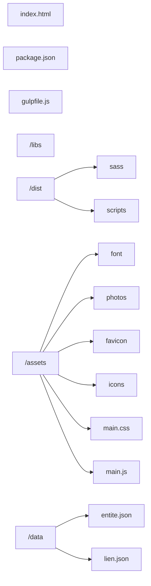
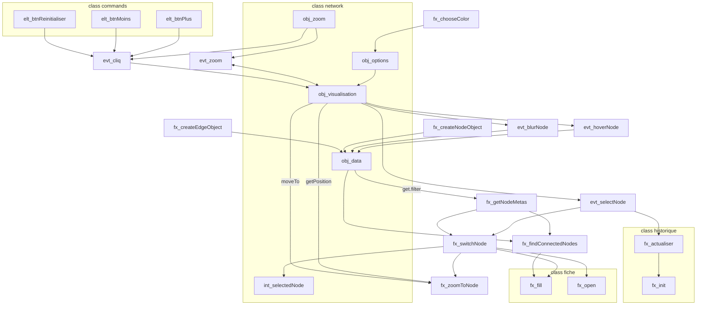

The following diagrams show the organization of the source code. They allow a better understanding of the software and thus to be able to make [modifications](../modify-source-code/dev-tools.md) more easily.

## File tree structure

The following diagram shows the distribution of files in the source code directory as it is possible to [upload to the GitHub repository](./installation.md).

!!! bug "Notice to developers"
	Be careful not to misplace any files or directories, otherwise some [software dependencies](./libraries.md) in the project may malfunction and you may lose functionality.

## Architecture of the *Network* functions

