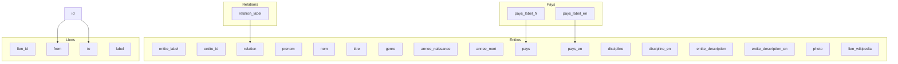

## Data entry

You will find in the [directory tree](./architecture-source-code/#file-tree-structure) Otletosphere the two JSON example files: `entite.json` and `lien.json`. To bring your own content you need to replace the values in these files according to the recommendations presented on this page.

### Data format

The data integrity constraint is strong. **It is necessary to link the different objects by their identifiers**, taking care during data entry to respect the typing and relational logic at the heart of the software.

!!! bug "Empty value, null value"
    Make sure that any values not filled in are typed as "null" in your JSON files. Otherwise fields may appear empty.

#### Entities

This involves registering all the entities that will be integrated into the *Network* and *Sheets* views of the site.

Below is a sample `entite.json` file and its data table describing the typing of the different values.

=== "JSON File"
    ```json
    [
        {
            "label": "Paul Otlet",
            "id": 1,
            "relation_otlet": "otlet",
            "prenom": "Paul",
            "nom": "Otlet",
            "titre": "Fondateur du Mundaneum",
            "genre": "Homme",
            "annee_naissance": 1868,
            "annee_mort": 1944,
            "pays": "Belgique",
            "pays_en": "Belgium",
            "discipline": "Bibliographie",
            "discipline_en": "Bibliography",
            "description": "Paul Otlet est la tête pensante du Mundaneum…",
            "description_en": "Paul Otlet is the mind behind the Mundaneum…",
            "photo": "OtletPaul.png",
            "lien_wikipedia": "https://fr.wikipedia.org/wiki/Paul_Otlet"
        }
    ]
    ```

=== "Data table"
    | Key             | Value                             | Comment                        |
    | --------------- | ---------------------------------- | ---------------------------------- |
    | id              | unique integer greater than 0 |  identifiant unique                |
    | label           | string                |  display name of the entity           |
    | relation        | string                |  entity's group name         |
    | titre           | string                |  short complement to the name           |
    | genre           | string                |  man or woman                    |
    | annee_naissance | integer                      |  year (ex: 1956)                  |
    | annee_mort      | integer                      |  year (ex: 1956)                  |
    | pays            | string                |                                    |
    | pays_en         | string                |  English translation               |
    | discipline      | string                |                                    |
    | discipline_en   | string                |  English translation               |
    | description     | string                |                                    |
    | description_en  | string                |  English translation               |
    | photo           | file path                  |  path, image name and extension    |
    | lien_wikipedia  | URL address                        |                                    |

#### Links

This defines the relationships between entities created according to the above model as they will appear in the *Network* view and the *Connections* portion of the [View Pane]().

Below is a sample `lien.json' file and its data table.

=== "JSON file"
    ```json
    [
        {
            "id": 1,
            "from": 1,
            "to" : 2,
            "label" : ""
        },
        {
            "id": 2,
            "from": 1,
            "to" : 3,
            "label" : "Il travaillent ensemble <b>depuis 10 ans<b>"
        }
    ]
    ```

=== "Data table"
    | Key   | Value                              | Comment                                           |
    | ----- | ----------------------------------- | ------------------------------------------------ |
    | id    | unique integer greater than 0  | identifiant unique lien                          |
    | from  | unique integer greater than 0  | identifiant unique entité                        |
    | to    | unique integer greater than 0  | identifiant unique entité                        |
    | label | HTML                                | description avec des balises `<b>`, `<i>`, `<a>` |

## Input

In order to complete, possibly in a collaborative way, your database with the numerous metadata, while respecting the integrity constraints and with the possibility of exporting easily in JSON, we advise you to use a spreadsheet type software.

Here's a *workflow* proposal.



### Tools

Here are some free, collaborative tools that are easy to use and allow you to set up an adequate input environment as presented above.

#### Airtable

[Airtable](https://airtable.com/) is a hybrid tool between spreadsheet and database and will best help you ensure the relationship between your entity objects and links, while managing the numerous metadata that you can easily standardize.

Once the different tables are completed, you can [link their contents](https://support.airtable.com/hc/en-us/articles/360042311734) in order to facilitate the entry, but also to ensure the relationship between the identifiers.

#### Google Sheet

The [Google Sheet](https://www.google.fr/intl/fr/sheets/about/) tool provided in Google Drive allows you to have an online spreadsheet and export to JSON using the *Export Sheet Data* extension.

??? tips "Exporter en JSON avec *Export Sheet Data*"
    Install the Google Sheet extension from the *Add-ons* tab, *Download Add-ons* button.
    In the same tab is now displayed the tool: once on your *Entities* or *Links* sheet, click on *Open Sidebar* and enter the following configuration (settings not mentioned below are on *off*, unchecked) :
    ```
    Export Format : JSON
    Export Sheet(s) : Current Sheet only
    Include first column : yes
    Export contents as array : yes
    ```
    The buttons at the bottom of the *Sidebar* allow you to complete the operation. All you have to do is to integrate the files in the `/data` directory of the [software tree](./architecture-source-code/#file-tree-structure).

Do not hesitate to use the [data validation] tool (https://support.google.com/docs/answer/186103?co=GENIE.Platform%3DDesktop&hl=fr) in conjunction with other sheets such as *Countries*, *Relations* etc. in order to standardize data completion as much as possible and avoid errors. You can also use the [integrated translation function](https://support.google.com/docs/answer/3093331?hl=fr) in Google Sheet for your multilingual versions or the [SEARCH function](https://support.google.com/docs/answer/3093318) to ensure the correspondence between your labels and unique identifiers.