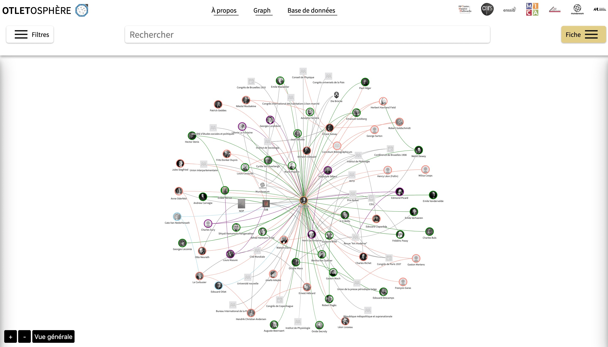

Feel free to [consult the FAQ](/faq) for quick answers to questions you may have.

## I am a user

You can start by reading the [interface description](/elements interface) to familiarize yourself with the different sections of the site.

Then, you can read the [tutorial on how to use the visualization](/navigation reseau) *Network* for a more efficient use.

## I am a developer

Do you want to reuse the project or study its design? You can find in this documentation all the information related to the [download and installation](/installation) of the functions, as well as the [source code architecture](/source code architecture), and list of [project dependencies](/bibliotheques).

