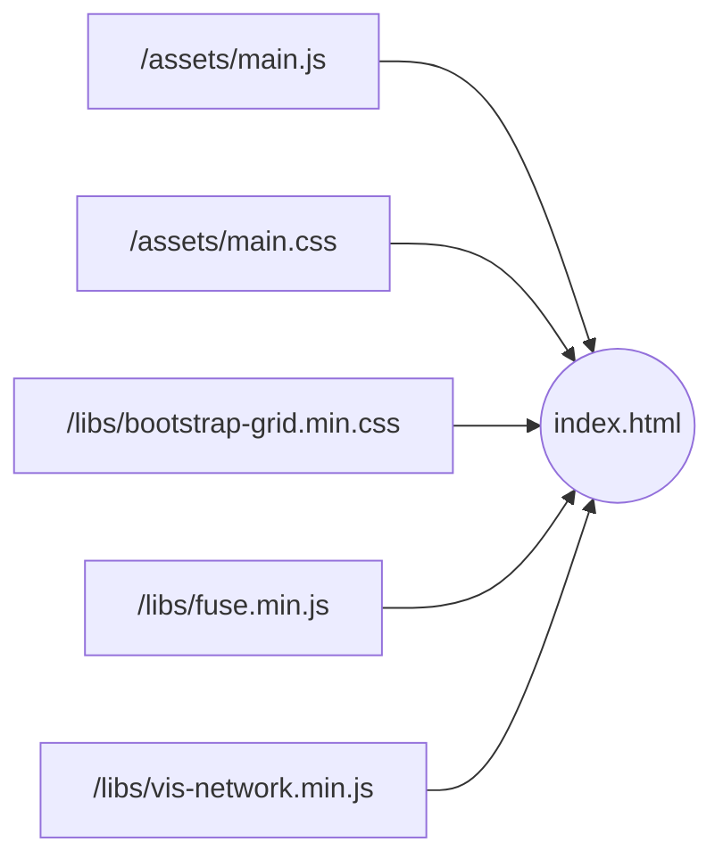

Once you have [downloaded and installed the Otletosphere software]() on your workstation, you can start modifying the source code, namely the `index.html`, `main.js` and `main.css` files. The other features come from the [libraries]().



To modify the `main.js` and `main.css` files, you have two options.

1. Use [development tools]() (distribution and compilation with Gulp.js)
2. Modify directly the source files

The first option allows you to take advantage of a source code broken down into different files that are easier to grasp, while the second will require you to move through a large volume of code. In both cases you will be guided through the tutorials; it is when you modify the code in a less guided way that it will be more constraining.

In addition to the tutorials, you will be provided with a [source code architecture guide]() to help you find your way around.

## Using the development tools

Gulp.js requires [additional installation]() before you can take advantage of its features.

Once the system is up and running, simply enter the following line in your command box while you are at the root of the source code directory. Two more lines should appear.

```bash hl_lines="1"
gulp watch
Using gulpfile ...\otletosphere\gulpfile.js
Starting 'watch'...
```

Therefore, any change

- of the JavaScript files located in the `/dist/scripts/` directory causes them to be concatenated into the `/assets/main.js` file;
- SCSS files located in the `/dist/sass/` directory causes them to be compiled into the `/assets/main.css` file.

The software is directly impacted.