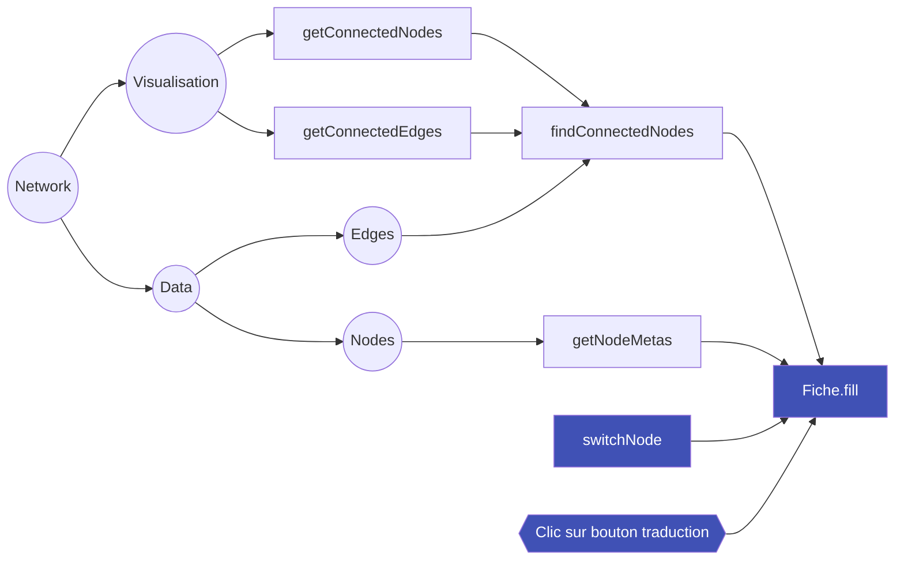
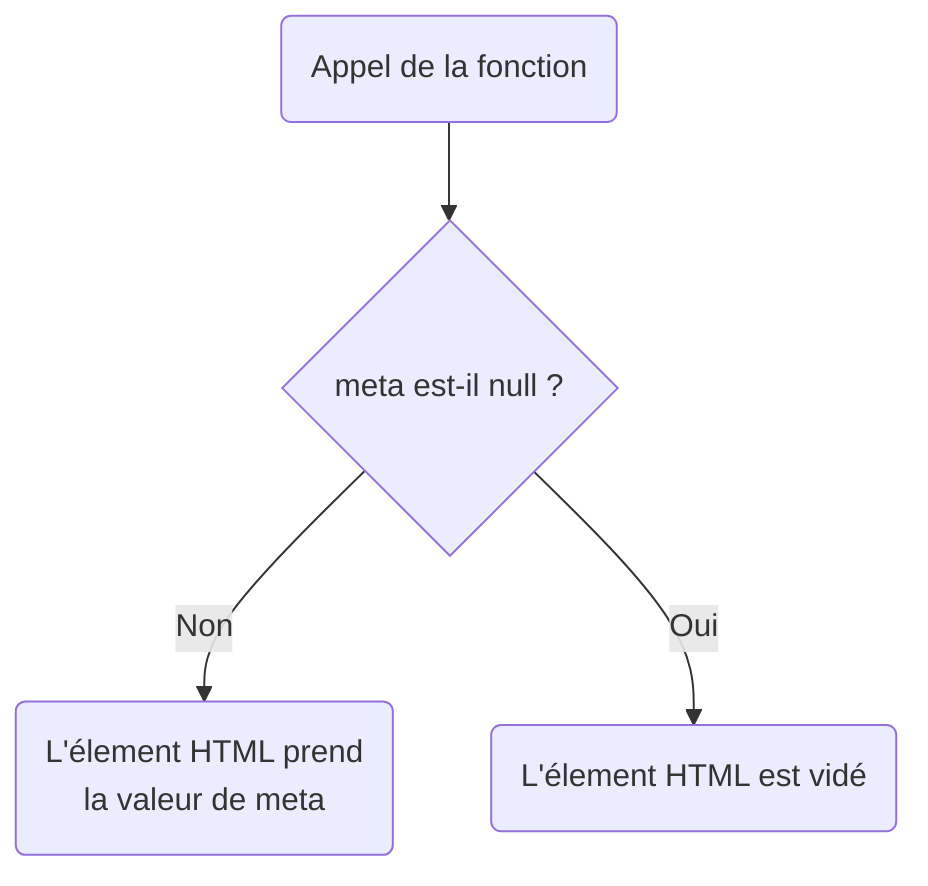

This tutorial will describe how to modify the content of the [description pane](../usage/interface-elements.md#description-panel), i.e. how to display the information available for each [selected entity](../usage/entities-selection.md#methods).

The following changes are made in the `/dist/scripts/fiche.js` file if you [use the development tools](../modify-source-code/dev-tools.md#using-the-development-tools). Otherwise you will need to modify the `/assets/main.js` file.

## Object architecture



We will focus on the `fill` function of the `fiche` object (noted `fiche.fill`). It is self-contained in the sense that calling `#!js fiche.fill()` will always complete the contents of the description pane with the currently selected node (global value `#!js network.selectedNode`) and in the right language (global value `#!js language.actual`).

This function returns the data it retrieves to other functions of the `fiche` object. It is these functions that will generate the HTML needed for the display and inject it into the [HTML tags](#reference-html-element) of the description pane. These tags are referenced in the `fiche.fields' object.

### Injection

The injection functions are all contained in the `fiche' object and are prefixed `set'. They can take two shapes.

In all cases they receive the metadata of an attribute of the `nodeMetas' object: `nodeMetas.year_birth` corresponds to the metadata `year_birth`.

```json hl_lines="5"
    [
        {
            "label": "Suzanne Briet",
            "id": 2,
            "annee_naissance": 1894,
            ...
        }
    ]
```

#### Generic form

The `file.setMeta' function takes as input a [metadata]() (`meta` parameter) and an [HTML element]() (`content' parameter).



#### Specific shape

For example, the `setDates file' function takes in several [metadata](#injection) to perform specific processing.

The [HTML element](#reference-html-element) where it will inject the generated HTML code is built directly into the function.

#### Reference HTML element

In the `fiche.fields` object you will find all references to HTML elements from `index.html`.

The selections are made using identifiers such as `#!js document.querySelector('#fiche-meta-date')` selects the `#!html <span id="fiche-meta-date"></span>` tag.

## Change the display

For your additions and modifications, all you have to do is identify the existing functions and modify their content according to the principles explained above.

The [function `file.setMeta`](#generic-form) allows you to quickly inject the contents of a metadata in a

!!! tip "Test the `null` values"
    Remember to integrate the tests:
    ```javascript
    if (meta === null) {
        content.innerHTML = '';
    }
    ```

!!! info "language display"
    To change the display of the pane according to the language, go to the [translation tutorial](./modify-translation.md#translate-description-panel).