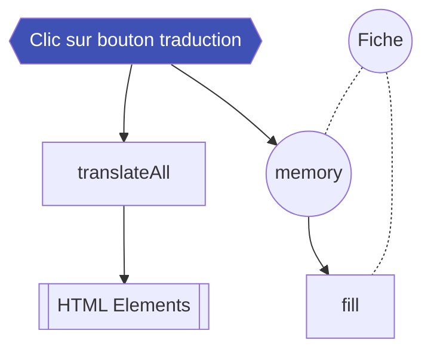

In the [header]() are the translation commands: buttons allow you to change the language on the site by activating a script that goes through the whole page, finds the elements to be translated and their translation to put the second one in place.

The script is in the `/dist/scripts/translate.js` file and [can be modified in different ways depending on the approach]() you have chosen to modify the source code.

## Translate an element

For an element embedded in HTML in `index.html` to be automatically translated, you must apply the attributes shown below to it. `data-lang-en` contains its French translation, and `data-lang-en` contains its English translation. Simply applying one of these tags to an element triggers its systematic translation. Be careful to apply all available languages to it.

```html
<h3 data-lang-fr="Connexions" data-lang-en="Connection">Connexions</h3>
```

## Add a language

To add a language, you need to add its reference button in `index.html`. You can place it in the `#!html <div class="lang-box">` tag or elsewhere. It is written in the following way to include the Russian language, for example: the attributes `id`, `data-lang` and `class` are all impacted.

```html
<div id="lang-ru" data-lang="Ru" class="lang-box__flag lang-box__flag--ru"></div>
```

In JavaScript, if we keep the same example, you need to add the `#!javascript document.querySelector('#lang-ru')` selector to the `langage.flags' array.

!!! success
    Therefore, any tag with the attribute `data-lang-ru="Lorem ipsum"` will have its text changed to "Lorem ipsum" when the corresponding button is clicked.

### Styliser le bouton

Depending on the [approach]() you have chosen to modify the source code you will have to follow the guidelines for SCSS or CSS.

=== "CSS"
    In `/assets/main.css`, find the `lang-box__flag` selector below which you can add the following lines and replace either `lang_ru.svg` with the name of the image of your choice or the full path `./icons/lang_ru.svg` if your image is not in the `/assets/icons/` directory.
    ```css
    .lang-box__flag--ru {
        background-image: url("./icons/lang_ru.svg");
    }
    ```

=== "SCSS"
    If your image matches the following path `./icons/lang_ru.svg` simply modify the following line in the `/dist/sass/layout/_entete.scss` file by adding `, "ru"`.
    ```scss
    $langages: "fr", "en", "ru";
    ```
    Alternatively, you can embed the following code within `/dist/sass/layout/_entete.scss` with the path to your image.
    ```scss hl_lines="7-9"
    .lang-box {
        ...

        &__flag {
            ...

            &--ru {
                background-image: url('lang_ru.svg');
            }
    }
    ```

## Translate description pane



In the `fill' function of the `file' object in the `/dist/scripts/fiche.js' file is this *switcher* which will allow you to toggle the display of metadata in the [description pane]() according to the active language.

For each `case' corresponding to a language you will be able to activate certain [display functions]() in the pane.

```javascript hl_lines="8"
switch (langage.actual) {
    case 'Fr':
        // fonctinos pour le français
        break;
    case 'En':
        // fonctions pour l'anglais
        break;
    case 'Ru':
        // fonctions pour le russe
        break;
}
```

You can write metadata for a particular language in the `entite.json` file, as in the example below.

```json hl_lines="6 7"
    [
        {
            "label": "Suzanne Briet",
            "id": 2,
            "relation": "contemporain",
            "description": "en français",
            "description_en": "en anglais",
        }
    ]
```

### Default language

To change the default language of the pane, you need to change the following line in the `language` object in the `/dist/scripts/translate.js` file. In the example below, the default language is Russian.

```javascript hl_lines="3"
var langage = {
    flags: [document.querySelector('#lang-ru'), document.querySelector('#lang-en')],
    actual: 'Ru',
    translateAll: function() { ... }
}
```