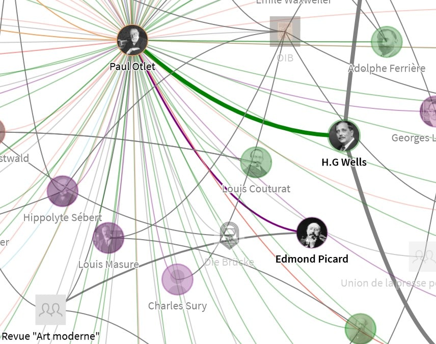

Here are a few explanations on the technical choices that were made by the design and development team, always with a view to offering an optimal and informative reading experience to Internet users.

## Following of navigation

For a complete data reading experience, it is necessary to be able to apprehend the data in different shapes. In this way, the fluidity of navigation is a key point that has determined the current structure of the site as a [stack of sections](). They each fill a screen and the header navigation allows you to switch from one to the other at any time.

### Union of views

Between the two views *Network* and *Records*, there was no link in the [first version of the site](). Neither the content nor the display continued between the two sections, which are now joined together.

Both views are now displayed from the site's single database. The different filtering options act simultaneously on the *Network* and *Records* sections, so that they become complementary.

Indeed, the *Network* view is more focused on relationships while the *Records* view allows to browse the entities listed in alphabetical order. As the first view is at the center of the project, we decided to make the users converge there.

Any entity selected, from one of the two views, is thus refocused on the *Network*. You can thus easily switch from the list of entities to the visualization of their relationships. The entity thus described is also highlighted so that the user can quickly grasp the network surrounding it and thus move on to another entity.

### Connections between nodes

The [Description panel]() provides a list of nodes attached to the node described into. This makes it easier to move from one node to another without having to move around the network with the mouse: when you click on one of the connections, the view automatically refocuses on it.

### History and addressing

Each time a map or node is clicked, the unique identifier of the linked entity is recorded in the page address, as well as in the browsing history. Also, its label becomes the title of the page that is saved in the browser. Thus, it is easy to retrieve an entity previously viewed: one could note its unique address or retrieve it in the browser history under the entity's name.

The *forward* and *backward* keys of the navigator also allow you to move back and forth between the entities displayed during navigation.

## Transparency effects

The density of the *Network* is such that it is difficult to read. It was decided to overcome this by implementing transparency effects on nodes and links, in interaction with the mouse.

When clicking on a node or map, the entity goes into *activated* mode. This has [various effects](), including highlighting the selected node's network by greasing its border and links. This did not seem to us sufficient for ease of reading, since the visualization should not only run through selections.

So we added an effect to the hover as well: as soon as the mouse passes over a node, all except its direct network become translucent. This state should not prevent the exceptional visualization of the node of the active entity, so it was also decided that this node and its network could not become translucent under any circumstances.

Thus it is possible to customize the view by clicking on a node that has become particularly visible and to add transparency effects with the hover feature. The combination of the two allows you to place a bold marker and see node by node hovering which relationships they have. This system makes the mouse a very efficient visualization tool with a handful of features quickly understood by the user.