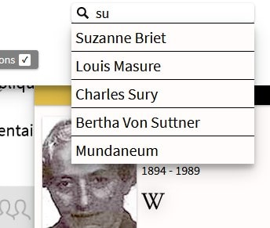

The Otletosphere is a visualization tool. The *Network* therefore occupies a central place on the site. The interface allows you to consult the database from which the *Network* is extracted through different views.

The interface is divided into three stacked sections presented in the site navigation :

- About us
- Network (inbound section)
- Fiches

## Network

This is the primary view: all entities in the database are represented in this graph. Do not hesitate to consult the [navigation tutorial](./network-navigation.md) to use it efficiently.

The nodes and links in the network are displayed in different colors corresponding to the different groups according to the entities' relationship with Paul Otlet.

Clicking on one of the nodes will allow you to [select the entity](./entities-selection.md).

## Description panel

It can be opened by clicking on the *i* icon or by selecting a node.

It contains all the information stored in the database about the [selected entity](./entities-selection.md).

!!! tip "Find the selected node"
	Wherever you are, clicking the "View" button at the top of the description pane displays the node within the *Network*.

### Connections

At the bottom of the description pane is the *connection* information of the entity. These are the nodes linked to the selected one: they are listed and clicking allows you to [select the entity](./entities-selection.md).

## Header

This element links the three sections of the site. The following tasks can be performed here that take immediate effect on the entire site:

- Back to home page
- Change [language](../process/multilingual.md)
- Change of section
- Entity search
- Sorting of displayed entities

### Search

The search bar allows you to find an entity according to its label. As you type, the [most relevant](../development/libraries.md#fusejs) labels appear. Clicking on a proposal allows you to [select the entity](./entities-selection.md) linked.

!!! info "Filtering Search Results"
	Search results are [filtered according to your instructions](./sort-entities.md). If a result is missing, it's probably because you dismissed it.

## Records

This section is the sub-view: the entities are no longer related in graphical form, but in the form of maps, listed and distributed in alphabetical order.

The description pane is [always displayed](../process/technical-choices.md#connections-between-nodes) and cannot be closed.

Clicking on a map allows you to [select entity](./entities-selection.md).

!!! tip
	An alphabetical list on the left allows you to jump from one letter to another.

## About

This last section contains a brief description of the project and its actors, be it the design and development team or the partners and sponsors.