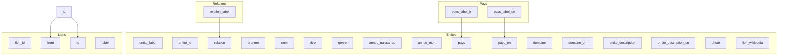

## Modèle des données

Vous trouverez dans l'[arborescence du répertoire](./architecture-code-source.md#arborescence-de-fichier) Otletosphère les deux fichiers d'exemple en JSON : `entite.json` et `lien.json`. Pour apporter votre propre contenu il vous faut remplacer les valeurs inscrites dans ces fichiers selon les recommandations présentées sur cette page.

### Format des données

La contrainte d'intégrité des données est forte. **Il est nécessaire de relier les différents objets par leurs identifiants** en prenant soin durant l'inscription des données de respecter le typage et la logique relationnelle au cœur du logiciel.

!!! bug "Valeur vide, valeur nulle"
    Faites bien attention à ce que les valeurs non remplies soient typée comme `null` au sein de vos fichiers JSON. Sans cela des champs pourront apparaître vides.

#### Entités

Il s'agit d'inscrire toutes les entités qui seront intégrées aux vues *Réseau* et *Fiches* du site.

Ci-dessous un modèle de fichier `entite.json` ainsi que sa table de données décrivant le typage des différentes valeurs.

=== "Fichier JSON"
    ```json
    [
        {
            "label": "Paul Otlet",
            "id": 1,
            "relation_otlet": "otlet",
            "prenom": "Paul",
            "nom": "Otlet",
            "titre": "Fondateur du Mundaneum",
            "genre": "Homme",
            "annee_naissance": 1868,
            "annee_mort": 1944,
            "pays": "Belgique",
            "pays_en": "Belgium",
            "domaine": "Bibliographie",
            "domaine_en": "Bibliography",
            "description": "Paul Otlet est la tête pensante du Mundaneum…",
            "description_en": "Paul Otlet is the mind behind the Mundaneum…",
            "photo": "OtletPaul.png",
            "lien_wikipedia": "https://fr.wikipedia.org/wiki/Paul_Otlet"
        }
    ]
    ```

=== "Table de données"
    | Clé             | Valeur                             | Commentaire                        |
    | --------------- | ---------------------------------- | ---------------------------------- |
    | id              | nombre entier unique supérieur à 0 |  identifiant unique                |
    | label           | chaine de caractère                |  nom affiché de l'entité           |
    | relation        | chaine de caractère                |  nom du groupe de l'entité         |
    | titre           | chaine de caractère                |  complément court au nom           |
    | genre           | chaine de caractère                |  homme ou femme                    |
    | annee_naissance | nombre entier                      |  année (ex: 1956)                  |
    | annee_mort      | nombre entier                      |  année (ex: 1956)                  |
    | pays            | chaine de caractère                |                                    |
    | pays_en         | chaine de caractère                |  traduction anglaise               |
    | domaine      | chaine de caractère                |                                    |
    | domaine_en   | chaine de caractère                |  traduction anglaise               |
    | description     | chaine de caractère                |                                    |
    | description_en  | chaine de caractère                |  traduction anglaise               |
    | photo           | chemin de fichier                  |  chemin, nom image et extension    |
    | lien_wikipedia  | adresse URL                        |                                    |

#### Liens

Il s'agit de définir les liens entre les entités créées selon le modèle ci-dessus telles qu'elles apparaîtront dans la vue *Réseau* et dans la partie *Connexions* du [volet de visualisation](../utilisation/elements-interface.md#connexions).

Ci-dessous un modèle de fichier `lien.json` et sa table de données.

=== "Fichier JSON"
    ```json
    [
        {
            "id": 1,
            "from": 1,
            "to" : 2,
            "label" : ""
        },
        {
            "id": 2,
            "from": 1,
            "to" : 3,
            "label" : "Il travaillent ensemble <b>depuis 10 ans<b>"
        }
    ]
    ```

=== "Table de données"
    | Clé   | Valeur                              | Commentaire                                           |
    | ----- | ----------------------------------- | ------------------------------------------------ |
    | id    | nombre entier unique supérieur à 0  | identifiant unique lien                          |
    | from  | nombre entier unique supérieur à 0  | identifiant unique entité                        |
    | to    | nombre entier unique supérieur à 0  | identifiant unique entité                        |
    | label | HTML                                | description avec des balises `<b>`, `<i>`, `<a>` |

## Injection des données

Pour personnaliser l'injection des données (leur intégration dans le logiciel via les fichiers JSON), vous devez modifier le fichier `/dist/scripts/fetch.js`. Il [peut être modifié de différentes manière selon l'approche](../modifier_code/outils-developpement.md) que vous avez choisi pour modifier le code source.

`#!js network.data.nodes.add` et `#!js network.data.edges.add` sont les deux fonctions permettant d'injecter les données respectivement comme nœuds et liens. Vous trouverez plus d'informations dans [cet exemple de la documentation de VisJs](https://github.com/visjs/vis-network#example). Ces deux fonctions recoivent en paramètre un tableau formé avec la fonction [`#!js Array.map()`](https://developer.mozilla.org/fr/docs/Web/JavaScript/Reference/Objets_globaux/Array/map) (voir code ci-dessous). Elle permet ainsi de transformer les données des fichiers JSON un objet prévu pour le logiciel, avec entre autres des valeurs prévues pour la [traduction](../modifier_code/modifier-traduction.md#traduire-les-données), mais aussi pour l'affichage dans la [visualisation](../utilisation/elements-interface.md#reseau).

```javascript
network.data.nodes.add(
    entites.map(function(entite) {
        var entiteObj = {
            // entite metas
            id: entite.id,
            label: entite.label,
            title: entite.titre,
            title_fr: entite.titre,
            title_en: entite.titre_en,
            image: '/otletosphere/assets/photos/' + entite.photo,

            // node style
            size : 30,
            margin: 20,
            font: {
                face: 'Open Sans'
                ...
            }
        };

        return entiteObj;
    })
);
```

## Saisie des données

Afin de compléter, éventuellement de manière collaborative, votre base de données avec les nombreuses métadonnées, tout en respectant les contraintes d'intégrité et avec la possibilité d'exporter facilement en JSON, nous vous conseillons de passer par un logiciel type tableur.

Voici une proposition de *workflow*, de circulation des données.



### Outils

Voici quelques outils gratuits, collaboratifs, intégrant des outils faciles à prendre en main et vous permettant de mettre en place un environnement de saisie adéquat comme présenté ci-dessus.

#### Airtable

[Airtable](https://airtable.com/) est un outil hybride entre tableur et base de données et pourra au mieux vous aider à assurer la relation entre vos objets entités et liens, tout en gérant les nombreuses métadonnées que vous pourrez facilement normaliser.

Une fois les différentes tables complétées, vous pouvez [relier leur contenu](https://support.airtable.com/hc/en-us/articles/360042311734) afin de faciliter la saisie, mais aussi assurer la relation entre les identifiants.

#### Google Sheet

L'outil [Google Sheet](https://www.google.fr/intl/fr/sheets/about/) fournit dans Google Drive vous permet de disposer d'un tableur en ligne et d'exporter en JSON grâce à l'extension *Export Sheet Data*.

??? tips "Exporter en JSON avec *Export Sheet Data*"
    Installez l'extension Google Sheet depuis l'onglet *Modules complémentaires*, bouton *Télécharger des modules complémentaires*.
    Dans le même onglet est désormais affiché l'outil : une fois sur votre feuille *Entités* ou *Liens*, cliquez sur *Open Sidebar* et entrez la configuration suivantes (les paramètres non mentionnés ci-dessous sont sur *off*, non cochés) :
    ```
    Export Format : JSON
    Export Sheet(s) : Current Sheet only
    Include first column : oui
    Export contents as array : oui
    ```
    Les boutons au bas du *Sidebar* vous permettent de terminer l'opération. Il ne vous reste qu'à intégrer les fichiers au repertoire `/data` de l'[arborescence du logiciel](/architecture code source/#arborescence-de-fichier).

N'hésitez pas à utiliser l'outil de [validation des données](https://support.google.com/docs/answer/186103?co=GENIE.Platform%3DDesktop&hl=fr) en lien avec d'autres feuilles comme *Pays*, *Relations* etc. afin de normaliser au maximum la complétion des données, d'éviter les erreurs. Vous pouvez aussi utiliser la [fonction de traduction intégrée](https://support.google.com/docs/answer/3093331?hl=fr) à Google Sheet pour vos versions multilingues ou encore la [fonction `RECHERCHEV`](https://support.google.com/docs/answer/3093318) pour assurer la correspondance entre vos labels et identifiants uniques.