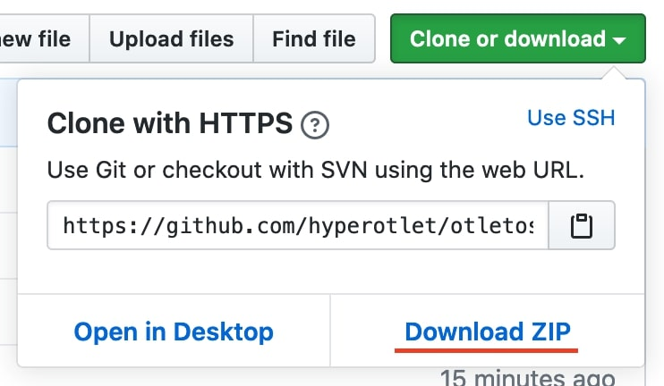

Les consignes suivantes permettent de télécharger et d'installer le logiciel faisant fonctionner l'Otletosphère afin de l'utiliser pour votre propre projet. Vous trouverez d'abord les consignes de téléchargement des différents paquets puis des explications supplémentaires pour installer les outils de développement et faciliter l'[édition du projet](../modifier_code/outils-developpement.md).

Pour modifier la [base de données du logiciel](./inscrire-donnees.md) ou son [fonctionnement](../modifier_code/outils-developpement.md), veuillez suivre les autres tutoriels.

## Téléchargement

La dernière version testée du code source est entreposée sur un [dépôt GitHub](https://github.com/hyperotlet/otletosphere). Deux méthodes d'installation s'offrent à vous.

### Par commande

Une fois à l'emplacement souhaité vous pouvez télécharger le contenu via la ligne de commande suivante si vous avez installé le [logiciel Git](https://git-scm.com/).

```bash
$ git clone https://github.com/hyperotlet/otletosphere.git
```

### Par archive



Vous pouvez également vous rendre sur le [dépôt GitHub](https://github.com/hyperotlet/otletosphere) et cliquer le bouton *Clone or download* puis sur *Download ZIP*. Vous n'avez alors plus qu'à décompresser l'archive téléchargée et à la placer à l'emplacement de votre choix :

- [décompresser une archive sur Windows](https://support.microsoft.com/fr-fr/help/14200/windows-compress-uncompress-zip-files)
- [décompresser une archive sur macOS](https://support.apple.com/fr-fr/guide/mac-help/mchlp2528/mac)

## Afficher le logiciel

L'application ne fonctionne que sur un serveur local (gratuit) comme [XAMP](https://www.apachefriends.org/fr/index.html) ou MAMP (Mac OS) ou sur un serveur connecté à Internet. Seul un serveur peut assurer les échanges internes en matière de données.

## Modifier le code avec Gulp.js

[Gulp.js](https://gulpjs.com/) est un module Node.js qui fonctionne largement avec les boîtes commandes (*Invite de commande* de Windows et *Terminal* de macOS). Voici un tutoriel d'installation complet sur le sujet : https://www.alsacreations.com/tuto/lire/1686-introduction-a-gulp.html

Le fichier `package.json` contient toutes les dépendances nécessaires et le `gulpfile.js` contient la configuration adaptée à l'environnement.

Pour installer les dépendances vous pouvez executer la commande suivante :

```bash
npm install
```

### Commandes

La commande suivante vous permet de lancer le traitement des fichiers `.scss` et `.js` repectivement depuis les [répertoires](./architecture-code-source.md#arborescence-de-fichier) `/sass` et `/scripts` vers `/assets/main.css` et `/assets/main.js`.

```bash
gulp watch
```

À chaque enregistrement d'un fichier `.scss` ou `.js` aux emplacements `/sass` ou `/scripts`, Gulp.js compile les fichiers.