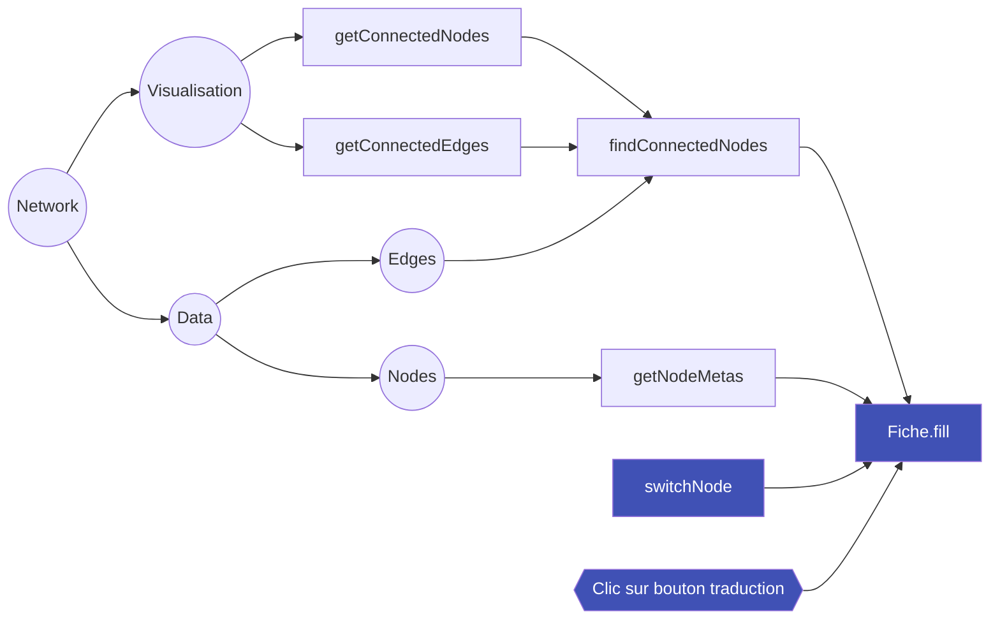
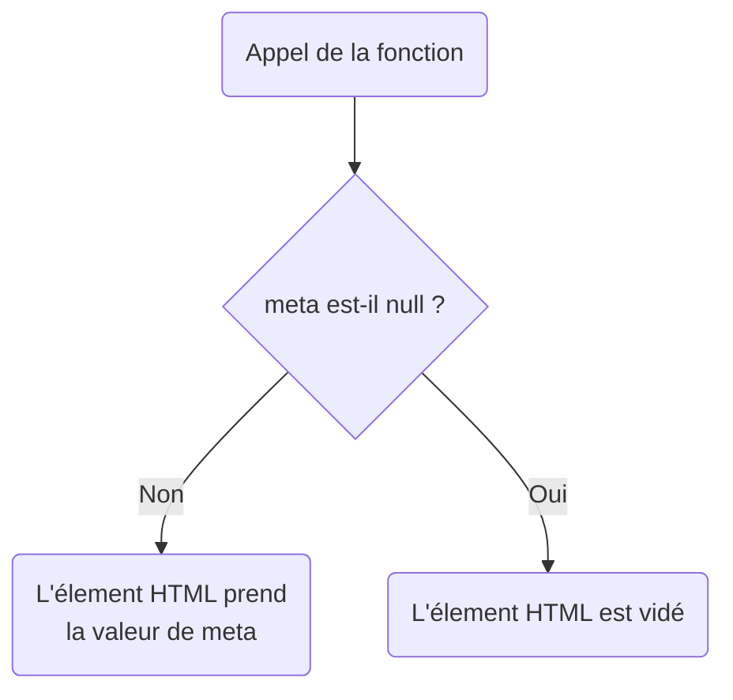

Ce tutoriel va décrire comment modifier le contenu du [volet de description](../utilisation/elements-interface.md), à savoir l'affichage des informations disponibles pour chaque [entité sélectionnée](../utilisation/selection-entites.md#methodes).

Les modifications suivantes s'effectuent dans le fichier `/dist/scripts/fiche.js` si vous [utilisez les outils de développements](./outils-developpement.md#utiliser-les-outils-de-developpement). Sinon vous devrez modifier le fichier `/assets/main.js`.

## Architecture de l'objet *Fiche*



Nous allons nous interesser à la fonction `fill` de l'objet `fiche` (noté `fiche.fill`). Elle est autonome dans le sens où appeler `#!js fiche.fill()` permettra toujours de compléter le contenu du volet de description avec le nœud actuellement sélectionné (valeur globale `#!js network.selectedNode`) et dans la bonne langue (valeur globale `#!js langage.actual`).

Cette fonction renvoie les données qu'elle récupère  vers d'autres fonctions de l'objet `fiche`. Ce sont ces fonctions qui vont générer le HTML nécessaire à l'affichage et l'injecter dans les [balises HTML](#element-html-de-reference) du volet de description. Ces balises sont référencées dans l'objet `fiche.fields`.

### Injection

Les fonctions d'injection sont toutes contenues dans l'objet `fiche` et sont préfixées `set`. Elles peuvent prendre deux formes.

Dans tous les cas elles reçoivent les métadonnées d'un attribut de l'objet `nodeMetas` : `nodeMetas.annee_naissance` correspond à la métadonnée `annee_naissance`.

```json hl_lines="5"
    [
        {
            "label": "Suzanne Briet",
            "id": 2,
            "annee_naissance": 1894,
            ...
        }
    ]
```

#### Forme générique

La fonction `fiche.setMeta` prend en entrée une [métadonnée](#injection) (paramètre `meta`) ainsi qu'un [élément HTML](#element-html-de-reference) (paramètre `content`).



#### Forme spécifique

Par exemple, la fonction `fiche.setDates` prend en entrée plusieurs [métadonnées](#injection) pour opérer un traitement spécifique.

L'[élément HTML](#element-html-de-reference) où elle va injecter le code HTML généré est intégré directement dans le fonction.

#### Élément HTML de référence

Dans l'objet `fiche.fields` vous retrouvez toutes les références aux éléments HTML issus de `index.html`.

Les sélections se font grâce à des identifiants tel que `#!js document.querySelector('#fiche-meta-date')` sélectionne la balise `#!html <span id="fiche-meta-date"></span>`

## Modifier l'affichage

Pour vos ajouts et modifications, il ne vous reste qu'à repérer les fonctions existantes et à modifier leur contenu selon les principes expliqués ci-dessus.

La [fonction `fiche.setMeta`](#forme-generique) vous permet de rapidement injecter le contenu d'une métadonnée dans un élément

!!! tip "Tester les valeurs `null`"
    Pensez à bien intégrer les tests :
    ```javascript
    if (meta === null) {
        content.innerHTML = '';
    }
    ```

!!! info "affichage par langue"
    Pour modifier l'affichage du volet selon la langue, rendez-vous sur le [tutoriel dédié à la traduction](/modifier traduction/#traduire-le-volet-de-description)