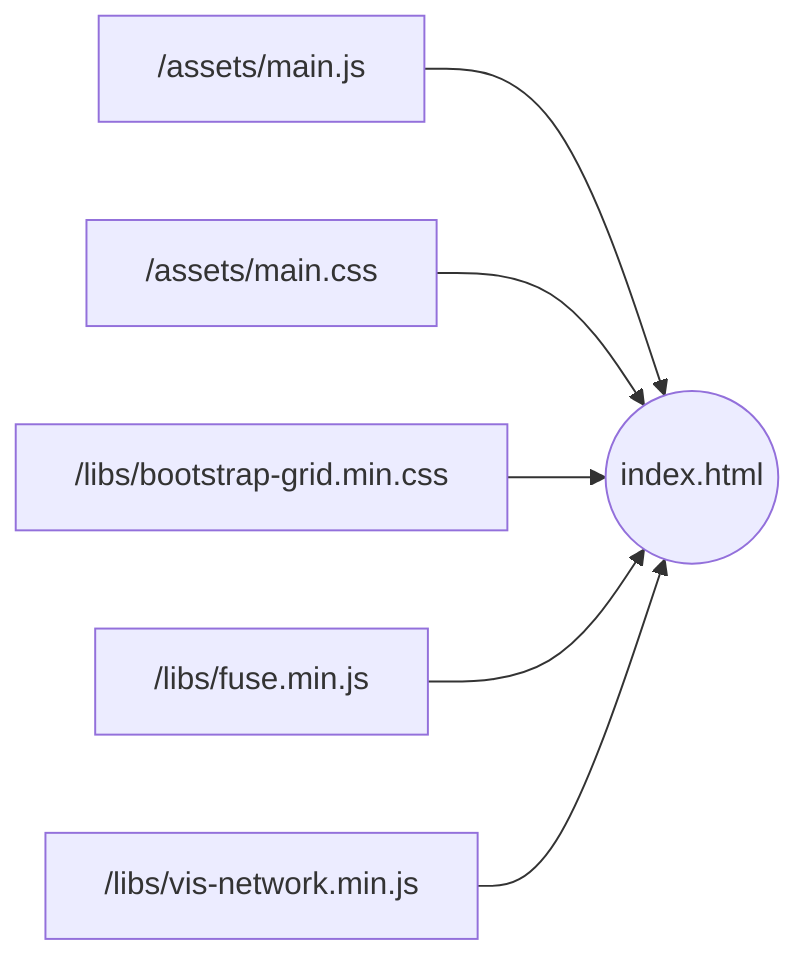

Une fois que vous avez [téléchargé et installé le logiciel](../developpement/installation.md) de l'Otletosphère sur votre station de travail, vous pouvez commencer à modifier le code source, soit les fichiers `index.html`, `main.js` et `main.css`. Les autres fonctionnalités émanent des [bibliothèques](../developpement/bibliotheques.md).



Pour modifier les fichiers `main.js` et `main.css`, vous avez deux possibilités.

1. Utiliser les [outils de développement](../developpement/bibliotheques.md#gulpjs) (distribution et compilation avec Gulp.js)
2. Modifier directement les fichiers sources

La première option vous permet de profiter d'un code source éclaté en différents fichiers qu'il est plus facile d'appréhender tandis que la seconde vous demandera de vous déplacer dans un volume de code important. Dans les deux cas vous serez guidé tout au long des tutoriels ; c'est lorsque vous modifierez le code de manière moins guidée que cela s'avèrera plus contraignant.

En plus des tutoriels vous profitez d'un [guide de l'architecture du code source](../developpement/architecture-code-source.md) afin de vous y repérer plus facilement.

## Utiliser les outils de développement

Gulp.js nécessite une [installation supplémentaire](../developpement/installation.md#gulpjs) avant de profiter de ses fonctionnalités.

Dès lors que le système est en place, vous n'avez qu'à entrer la ligne suivante dans votre boîte de commande alors que vous vous trouver à la racine du répertoire du code source. Deux autres lignes devraient apparaître.

```bash hl_lines="1"
gulp watch
Using gulpfile ...\otletosphere\gulpfile.js
Starting 'watch'...
```

Dès lors, toute modification

- des fichiers JavaScript situés dans le répertoire `/dist/scripts/` entraine leur concaténation dans le fichier `/assets/main.js` ;
- des fichiers SCSS situés dans le répertoire `/dist/sass/` entraine leur compilation dans le fichier `/assets/main.css`.

Le logiciel est directement impacté.