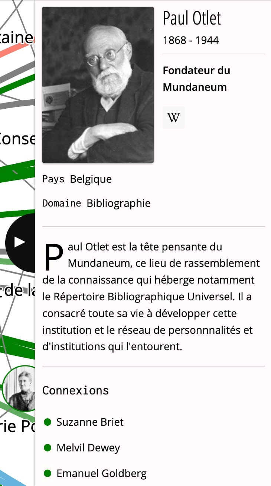
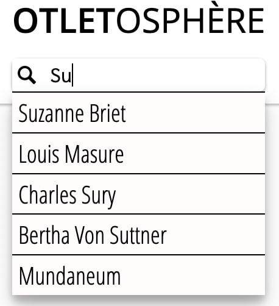

L'Otletosphère est un outil de visualisation. Le *Réseau* occupe donc une place centrale sur le site. L'interface permet de consulter par différentes vues la base de données dont est extrait le *Réseau*.

L'interface est divisée en trois sections empilées et présentées dans la navigation du site :

- À propos
- Réseau (section d'arrivée)
- Fiches

## Réseau

Il s'agit de vue primaire : toutes les entités de la base de données sont représentées au sein de ce graphique. N'hésitez pas à consulter le [tutoriel de navigation](./navigation-reseau.md) pour l'utiliser efficacement.

Les nœuds et liens du réseau sont affichés dans différentes couleurs correspondant aux différents groupes selon les relations des entités avec Paul Otlet.

Cliquer sur l'un des nœuds va vous permettre de le [sélectionner l'entité](./selection-entites.md).

## Volet de description

Il peut être ouvert en cliquant sur l'icone *i* ou en séléctionnant un nœud.

Il contient toutes les informations stockées dans la base de données au sujet de l'[entité sélectionnée](./selection-entites.md).

!!! tip "Retrouver le nœud sélectionné"
	Où que vous soyez, cliquer sur le bouton "Visualiser" en haut du volet de description affiche le nœud au sein du *Réseau*.

### Connexions

Au bas du volet de description on retrouve les informations de *connexion* de l'entité. Il s'agit des nœuds liés à celui qui a été sélectionné : ils sont listés et cliquer permet de [sélectionner l'entité](./selection-entites.md).

## Entête

Cet élément fait le liens entre les trois sections du site. On peut y exectuer les tâches suivantes qui prennent immédiatement effet sur l'ensemble du site :

- Retour à l'accueil
- Changement de [langue](../demarche/multilingue.md)
- Changement de section
- Recherche d'entité
- Tri des entités affichées

### Recherche

La barre de recherche permet de trouver une entité selon son [label](Métadonnées). Au fur et à mesure de la saisie, les labels [les plus pertinent](../developpement/bibliotheques.md#fusejs) apparaissent. Cliquer sur une proposition permet de [sélectionner l'entité](./selection-entites.md) liée.

!!! info
	Vider la barre de recherche cache la liste des résultats.

## Fiches

Cette section est la vue secondaire : les entités ne sont plus mises en relation sous forme graphique, mais sous forme de cartes, listées et réparties par ordre alphabétique.

Le volet de description est [toujours affiché](../demarche/choix-technique.md#connexions-entre-les-nuds) et ne peut être fermé.

Cliquer sur une carte permet de [sélectionner l'entité](./selection-entites.md).

!!! tip
	Une liste alphabétique à gauche vous permet de sauter d'une lette à une autre.

## À propos

Cette dernière section contient une brève description du projet et de ses acteurs, qu'il s'agisse de l'équipe de conception et développement ou bien des partenaires et mécènes.