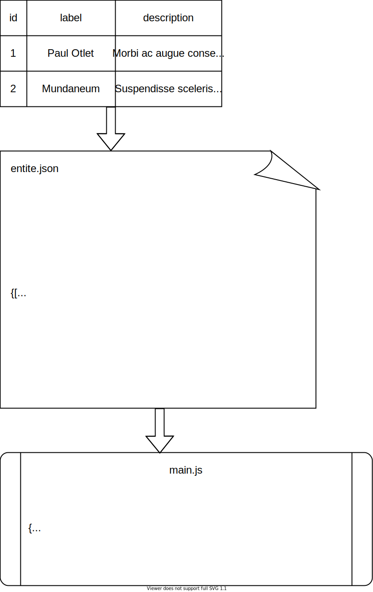

L’Opensphère est un logiciel de cartographie relationnelle interactive conçu par l’équipe du programme de recherche ANR [HyperOtlet].

Les fonctionnalités du logiciel et leur utilisation sont décrites dans le [manuel d'utilisation](https://hyperotlet.github.io/otletosphere/) de l'[Otletosphère], qui constitue l'origine du projet (voir les [exemples d'utilisation](#exemples-dutilisation) plus bas).

Cette documentation s’adresse aux personnes souhaitant réutiliser le code de l'Opensphère.

L'Opensphère a été conçue pour faciliter la réutilisation. Son fonctionnement nécessite uniquement un serveur web local ou en ligne. Le code est écrit en JavaScript mais il n'est pas nécessaire de connaître ce langage pour s'approprier le logiciel : il suffit de modifier le code aux endroits indiqués dans cette documentation pour l'adapter à ses données et métadonnées. Quelques [notions de base en HTML](https://developer.mozilla.org/fr/docs/Learn/Getting_started_with_the_web/HTML_basics) peuvent être utiles. La documentation s'adresse également aux personnes maîtrisant JavaScript, avec des ressources permettant personnaliser le logiciel en profondeur.

::: sommaire
1. [Installation](#installation)
2. [Format des données](#format-des-donnees)
3. [Intégration des données](#integration-des-donnees)
4. [Langues](#langues)
5. [Publication](#publication)
6. [Exemples d’utilisation](#exemples-dutilisation)
7. [Crédits](#credits)
:::

# Installation

## Pré-requis

Un serveur web est requis pour faire fonctionner l’Opensphère. En effet, les fichiers de données ne peuvent être utilisés par le logiciel que grâce à des protocoles propres aux serveurs.

Pour afficher l'Opensphère en local, utilisez un logiciel comme [WAMP](https://www.wampserver.com/) (Windows), [MAMP](https://www.mamp.info/fr/downloads/) (Windows, macOS) ou [XAMP](https://www.apachefriends.org/fr/index.html) (Windows, macOS, Linux).

Pour héberger l'Opensphère en ligne, il vous faudra un moyen de transférer les fichiers de l’Opensphère sur un serveur, par exemple avec un client FTP comme [FileZilla](https://filezilla-project.org/) (Windows, macOS, Linux).

<!-- 
[Téléchargez et installez Node.js](https://nodejs.org/fr/).

Installez NPM :

```bash
npm install -g npm
```

[Téléchargez et installez Gulp](https://gulpjs.com/docs/en/getting-started/quick-start).

[Gulp] est utilisé pour transpiler les fichiers JavaScript contenus dans le répertoire `/dist` en un seul fichier `main.js`. Ceci permet de compenser la complexité du projet (un millier de lignes de JavaScript) et la diversité des fonctions en les répartissant dans quelques fichiers d’une centaine de lignes seulement chacun.

Installation des dépendances :

```bash
npm i
```
 -->

## Téléchargement

Le code de l'Opensphère est hébergé sur GitHub : <https://github.com/hyperotlet/opensphere>. Pour télécharger la dernière version, rendez-vous sur [la page des téléchargements](https://github.com/hyperotlet/opensphere/releases).

Vous pouvez également cloner le dépôt via un client Git, comme par exemple [GitHub Desktop](https://desktop.github.com/) (Windows, macOS), ou via un terminal en saisissant la commande suivante :

```bash
git clone https://github.com/hyperotlet/opensphere.git
```

Déplacez le dossier `opensphere` dans le dossier racine de votre serveur, ou bien configurez votre serveur pour faire du dossier `opensphere` la racine.

<!-- 
## Utilisation

La modification des fichiers HTML et CSS ne nécessite pas de manipulation particulière.

La modification des fichiers JavaScript contenus dans le dossier `/dist` nécessite de lancer Gulp.

```bash
gulp watch
```

Tant qu'il est actif, Gulp surveille le répertoire `/dist`. Lorsque des modifications sont enregistrées dans un fichier de ce répertoire, Gulp répercute les modifications sur le fichier `/assets/main.js`.
 -->

# Format des données

L’Opensphère requiert que les données décrivant les entités et leurs relations soient contenues séparément dans deux fichiers [JSON](https://developer.mozilla.org/fr/docs/Learn/JavaScript/Objects/JSON) nommés respectivement `entite.json` et `lien.json`. Ces deux fichiers doivent être placés dans le répertoire `/data`.

## Entités

### Métadonnées requises

L'exemple ci-dessous constitue une version simplifiée du fichier `entite.json`. Il présente les métadonnées qui doivent obligatoirement être présentes pour que l'Opensphère fonctionne :

```json
[{
    "label": "Paul Otlet",
    "id": 1,
    "group": "Personne",
    "description": "Fondateur du Mundaneum"
},
{
    "label": "Mundaneum",
    "id": 2,
    "group": "Institution",
    "description": "Le projet phare de Paul Otlet"
}]
```

### Ajouter des métadonnées

Vous pouvez ajouter autant de métadonnées que vous le souhaitez pour chaque entité. Ceci permet notamment de décliner les informations dans plusieurs [langues](#langues). L'exemple ci-dessous montre un extrait des données de l'[Otletosphère].

```json
[{
    "label": "Paul Otlet",
    "id": 1,
    "type": "Personne",
    "description": "Fondateur du Mundaneum",
    "annee_naissance": 1868,
    "annee_mort": 1944,
    "pays": "Belgique",
    "pays_en": "Belgium",
    "domaine": "Bibliographie",
    "domaine_en": "Bibliography",
    "lien_wikipedia":"https://fr.wikipedia.org/wiki/Paul_Otlet",
    "lien_wikipedia_en":"https://en.wikipedia.org/wiki/Paul_Otlet"
}]
```

## Liens

L'exemple ci-dessous constitue une version simplifiée du fichier `lien.json`. Les liens reposent sur les identifiants des entités. Les liens eux-mêmes ont un identifiant distinct. Par exemple, le lien `1` relie les entités `1` et `2`.

```json
[{
    "id": 1,
    "from": 1,
    "to": 2,
    "label": "Paul Otlet est le fondateur du Mundaneum."
}]
```

## Modèles réutilisables

Générer des données au format requis pour l'Opensphère nécessite de disposer d'outils permettant la saisie des données, leur mise en relation par un système d'identifiants uniques, et leur export au format JSON. Nous proposons des modèles Google Sheets et Airtable afin de faciliter ces différentes étapes.

### Modèle Google Sheets

Un modèle Google Sheets pour l'Opensphère est disponible à l'adresse suivante : [https://docs.google.com/spreadsheets/d/1hiONQ5SM82vKTAzMH2NRU3nNGQMToOU-TGaTfxxT0u4/edit?usp=sharing](https://docs.google.com/spreadsheets/d/1hiONQ5SM82vKTAzMH2NRU3nNGQMToOU-TGaTfxxT0u4/edit?usp=sharing)

[Google Sheets](https://www.google.com/sheets/about/) est un tableur classique, qui repose sur des formules pour contrôler la saisie des données. Notre modèle inclut des formules, notamment pour faire correspondre automatiquement les identifiants d'une feuille à l'autre. Afin de ne pas rencontrer de difficultés, n'oubliez pas d'étendre les formules sur plusieurs lignes après avoir saisi des données.

La saisie des données concernant les entités se fait dans la feuille « Entités ». La saisie des données concernant leurs relations se fait dans la feuille « Liens ». La feuille « Extraction » doit être remplie automatiquement grâce une formule qui remplace les noms des identités par les identifiants correspondants (grâce à la [fonction `RECHERCHEV`](https://support.google.com/docs/answer/3093318?hl=fr). Ceci permet de saisir les relations dans une interface confortable (la feuille « Liens ») tout en exportant les données au format requis depuis une feuille ad hoc (la feuille « Extraction »).

Pour exporter les données au format JSON, installez l’extension [Export Sheet Data](https://workspace.google.com/marketplace/app/export_sheet_data/903838927001) depuis l’onglet `Modules complémentaires` dans Google Sheets.

Une fois l'extension installée, cliquez sur `Modules complémentaires` › `Export Sheet Data` › `Open Sidebar`. Suivez les instructions détaillées dans la feuille « Notice export » pour exporter les feuilles « Entités » et « Extraction ».

### Modèle Airtable

Un modèle Airtable pour l'Opensphère est disponible à l'adresse suivante : [https://airtable.com/shrBRlWxvzFatUoFF/tblHqN5RE9z7j5HdU/viwn2Q7y4fijyAfSs](https://airtable.com/shrBRlWxvzFatUoFF/tblHqN5RE9z7j5HdU/viwn2Q7y4fijyAfSs)

[Airtable](https://airtable.com/) est un logiciel qui permet d'utiliser une base de données via l'interface d'un tableur collaboratif en ligne. [Une documentation](https://support.airtable.com/hc/en-us) est disponible en anglais. Notre modèle inclut des règles qui permettent de contrôler la saisie des données.

Les tables « entites » et « liens » peuvent être exportées au format CSV. Vous devrez utiliser un [convertisseur CSV-JSON](http://convertcsv.com/json-to-csv.htm) pour obtenir les fichiers `entite.json` et `lien.json` requis.

# Intégration des données

Une fois les fichiers `entite.json` et `lien.json` placés dans le répertoire `/data`, il faut modifier le code de l'Opensphère pour qu'elle puisse intégrer les données.

## Entités

La commande d’intégration des données représentant les entités se trouve dans le fichier `/assets/main.js` à partir de la ligne 20. Un extrait simplifié est présenté ci-dessous.

```javascript
network.data.nodes.add(
    entites.map(function(entite) {
        var entiteObj = {
            id: entite.id,
            label: entite.label,
            title: entite.titre,
            age: Number(entite.age) + 6,
            type: entite.type,
            description: entite.description,
            image:'./assets/photos/' + entite.photo,
            Fr: {
                title: entite.titre
            },
            En: {
                title: entite.titre_en
            }
        };
```

Cette commande permet de faire correspondre les métadonnées, c'est-à-dire les entêtes de colonnes dans le tableur, à des constantes JavaScript. Ce sont ces constantes qui sont ensuite utilisées ensuite dans tout le logiciel pour manipuler les métadonnées correspondante. Le schéma ci-dessous permet de bien distinguer métadonnées et constantes.

{width=350}

Chaque métadonnée est préfixée par le nom du jeu de données auquel elle appartient (`entite` ou `lien`). On fait correspondre cette métadonnée préfixée à une constante. <!-- dont le nom peut être choisi de manière arbitraire mais pas toujours, certaines dépendent de vis.js ?--> Par exemple, la métadonnée `titre` est appelée sous la forme `entite.titre` et associée à une constante `title`.

Les constantes peuvent être définies en incluant des transformations, comme par exemple en effectuant une opération mathématique sur une métadonnée numérique.

Les métadonnées peuvent être regroupées pour gérer les [langues](#langues).

## Liens

L'intégration des données représentant les relations utilise une commande similaire située quelques lignes plus bas, toujours dans le fichier `/assets/main.js`.

Exemple :

```javascript
network.data.edges.add(
    liens.map(function(lien) {
        var lienObj = {
            id: lien.id,
            from: lien.from,
            to: lien.to,
            title: lien.label,
            Fr: {
                title: lien.label
            },
            En: {
                title: lien.label_en
            }
        };
```

## Groupes

Lors de l’intégration, une constante `group` doit être déclarée pour chaque entité. Idéalement, celle-ci correspond à une catégorisation des entités, effectuée via une métadonnée dédiée. Ceci permet de définir des paramètres d'affichage dans le graphe qui s'appliquent en bloc à toutes les entités au sein du même groupe. La liste complète des paramètres est disponible sur la page [Network - Nodes](https://visjs.github.io/vis-network/docs/network/nodes.html) de la documentation de [Vis.js](https://visjs.org).

Ces paramètres doivent être déclarés dans le fichier `/assets/main.js`, vers la ligne 160. Un extrait simplifié est présenté ci-dessous :

```javascript
groups: {
    amis: {shape: 'circle', color: {border: grey}, size: 20},
    ennemis: {shape: 'square', color: {border: rgb(84,84,194)}, size: 10}
}
```

## Images

Par défaut, toutes les entités doivent être associées à une image. Chaque entité peut avoir sa propre image, ou bien la partager avec d'autres entités.

::: astuce
L'[Otletosphère](http://hyperotlet.huma-num.fr/otletosphere/) et l'[OpenDataSphère](http://hyperotlet.huma-num.fr/opendatasphère/) montrent deux façons d'envisager l'utilisation des images. La première utilise des photographies pour mettre en valeur les personnes. La seconde utilise des icônes qui font ressortir les catégories des entités.
:::

Les images doivent être placées dans le répertoire `/assets/photos`. La métadonnée utilisée pour déclarer l'image associée à une entité doit contenir le nom complet du fichier (nom et extension). Exemple : `nom_image.jpg`.

L'intégration de la métadonnée se fait via une constante `image`. Exemple avec une métadonnée intitulée `photo` :

```javascript
image:'./assets/photos/' + entite.photo`
```

Si vous ne souhaitez pas utiliser d’images, effectuez les modifications suivantes dans `/assets/main.js` :

- Ligne ~30 : supprimer la ligne correspondant à la constante `image` dans la commande d’intégration.
- Ligne ~150 : remplacer la valeur de `shape` (initialement `image`) une autre valeur comme `circle` ou `square`. La liste complète des paramètres est disponible sur la page [Network - Nodes](https://visjs.github.io/vis-network/docs/network/nodes.html) de la documentation de [Vis.js](https://visjs.org).
- Ligne ~160 : supprimer le paramètre `shape:'circularImage'` pour les différents groupes définis dans `groups`.

## Affichage latéral

L’affichage des métadonnées dans l'Opensphère reprend la logique de la fiche, incarnée par un panneau latéral situé à droite de l’interface. Le paramétrage de cette « fiche » consiste à modifier le fichier `index.html` pour créer des champs faisant appel aux différentes constantes définies au préalable dans `/assets/main.js`.

Dans le fichier `index.html`, la région à modifier se trouve peu après la ligne 250 au niveau du commentaire indiquant `LATERAL FICHE`. Le volet correspond à l'élément `aside`. Le contenu à modifier est situé dans le `div` portant l'identifiant `fiche-content`.

Pour ajouter un champ, ajoutez un élément `span` ou `div` portant l’attribut `data-meta`. La valeur de cet attribut doit être l'une des constantes définies dans `/assets/main.js`. L'élement doit rester vide (la balise fermante suit immédiatement la balise ouvrante). Lorsqu'une entité est sélectionnée dans l'interface de l'Opensphère, le logiciel remplit automatiquement chaque élément `span` ou `div` présent dans le volet avec la valeur des métadonnées correspondantes.

Exemple :

```html
<aside id="fiche">
    …
    <main id="fiche-content">
        …
        <span data-meta="title"></span>
        <div data-meta="description"></div>
    </main>
</aside>
```

## Filtres

L'Opensphère inclut un système de filtres qui permettent d’afficher ou de cacher les entités en fonction d'un paramètre donné.

Les boutons s'affichent soit dans l'entête du site pour les grands écrans (affichage *« desktop »* ), soit dans un menu accessible depuis le bouton entonnoir en haut à droite de la zone d'affichage du graphe, pour les petits écrans (affichage *« mobile »* ). Ils sont créés via le fichier `index.html` à deux endroits distincts : ligne ~160 pour les boutons *desktop* et ligne ~260 pour les boutons *mobile*.

Chaque filtre correspond à un élément `button` avec la classe `btn-group`, un attribut `data-type` et un attribut `data-meta`. La valeur de `data-type` doit être l'une des constantes définies dans `/assets/main.js` : c'est le paramètre sur lequel doit jouer le filtre. La valeur de l’attribut `data-meta` correspond à la valeur de cette constante pour le filtre.

::: astuce
Ce mécanisme permet de combiner plusieurs modes de catégorisation dans un même jeu de données. Par exemple, l'[OpenDataSphère] classe les entités de deux manières : par type, c'est-à-dire en fonction de la nature de l'entité (personne, organisation…) et par catégorie thématique.
:::

L'exemple ci-dessous correspond à un filtre qui permet d'afficher ou de cacher les entités appartenant au groupe `institution` :

```html
<button class="btn-group" data-type="group" data-meta="institution">institution</button>
```

# Langues

L'Otletosphère peut accueillir plusieurs langues, aussi bien au niveau des données que de l'interface. Il est recommandé d'utiliser les codes de langue définis par la norme [ISO 639](https://www.iso.org/iso-639-language-codes.html) pour désigner les différentes langues à la fois dans les données, le code et l'interface.

## Données

L'intégration de métadonnées exprimées dans plusieurs langues se fait au même niveau que les métadonnées standard dans `/assets/main.js`. Chaque métadonnée doit être associée à une constante, de manière normale. Il faut ensuite regrouper les déclarations par langue.

Exemple :

```javascript
{
titre: entite.titre,
description: entite.description,
Fr: {
    title: entite.titre,
    description: entite.description
},
En: {
    title: entite.titre_en,
    description: entite.description_en
},
Ru: {
    title: entite.titre_ru,
    description: entite.description_ru
}
```

## Éléments d'interface

Pour traduire un élément de l'interface, ajoutez-y un attribut `data-lang-<code>` ayant pour valeur la traduction de l'élément, en remplaçant `<code>` par la constante correspondant à la langue de la traduction, définie précédemment. <!-- sensibilité à la casse ? -->

Exemple :

```html
<p data-lang-ru="traduction en russe">texte d’origine</p>
```

## Sélecteur de langue

Un sélecteur situé en haut à droite de l'interface permet de changer de langue à la volée. Pour ajouter une langue, localisez l'élément `section` portant la classe `lang-box`, vers la ligne 150 du fichier `index.html`. Ajoutez à l'intérieur un `div` avec un attribut `data-lang` : la valeur de l'attribut doit être la constante que vous avez définie pour la langue en question, la valeur du `div` sera le texte affiché sur le bouton.

Exemple :

```html
<div data-lang="Ru">Russe</div>
```

# Publication

L'Opensphère se présente sous la forme d'un fichier `index.html` pensé pour être publié sur le Web. Pour faciliter la tâche des programmes d'indexation et de moissonnage du Web, vous pouvez compléter les métadonnées incluses dans le `head` du fichier `index.html`, notamment les attributs `content` et `href` vides ou contenant du texte par défaut.

<!-- Lister les fichiers à inclure notamment .htaccess et son importance -->

# Exemples d'utilisation

Otletosphère
: Cartographie relationnelle autour de Paul Otlet réalisée par l’équipe du programme de recherche ANR [HyperOtlet]
: Site : <http://hyperotlet.huma-num.fr/otletosphere/>
: Code source : <https://github.com/hyperotlet/otletosphere>

OpenDataSphère
: Cartographie relationnelle de l'open data francophone réalisée par les étudiantes et étudiants de la [licence professionnelle MIND](http://www.infonumbordeaux.fr/mind/).
: Site : <http://hyperotlet.huma-num.fr/opendatasphere/>
: Code source : <https://github.com/hyperotlet/opendatasphere>

# Crédits

## Équipe

- [Olivier Le Deuff](http://www.guidedesegares.info) (chef de projet)
- [Guillaume Brioudes](https://myllaume.fr/) (développeur)
- [Arthur Perret](https://www.arthurperret.fr) (chercheur)
- [Clément Borel](https://mica.u-bordeaux-montaigne.fr/borel-clement/) (chercheur)
- [Jean David](http://jdavid.fr) (développeur)

## Historique du projet

2019
: Développement de l'[Otletosphère 1.0](http://jdavid.fr/projets/otletosphere.html) par [Jean David](http://jdavid.fr).

2020
: Développement de l'[Otletosphère 2.0](https://hyperotlet.huma-num.fr/otletosphere/) par Guillaume Brioudes.

2021
: Réutilisation de l'Otletosphère par les étudiants de la LP MIND 2020-2021 sous la direction d'Arthur Perret. Développement de l'Opensphère comme projet central autonome.

## Bibliothèques utilisées

Pour améliorer la maintenabilité et la lisibilité du code source, l’équipe de développement a recouru aux bibliothèques suivantes. Elles sont été intégrées directement au code source de l’Opensphère et ne nécessitent par conséquent aucun téléchargement.

- [Vis.js](https://github.com/visjs/vis-network) v7.10.2 (licence Apache 2.0) : réalisation de la visualisation ainsi que du système de circulation des données grâce à ses deux composants *Network* et *DataSet*.
- [Fuse.js](https://github.com/krisk/Fuse/) v6.4.1 (licence Apache 2.0) : mise en place du moteur de recherche.
- [Bootstrap Grid](https://github.com/twbs/bootstrap) v4.5.0 (licence MIT) : flexibilité de l’interface pour mobile.

[Gulp]: https://gulpjs.com/
[HyperOtlet]: https://hyperotlet.hypotheses.org/
[OpenDataSphère]: http://hyperotlet.huma-num.fr/opendatasphere/
[Otletosphère]: http://hyperotlet.huma-num.fr/otletosphere/
